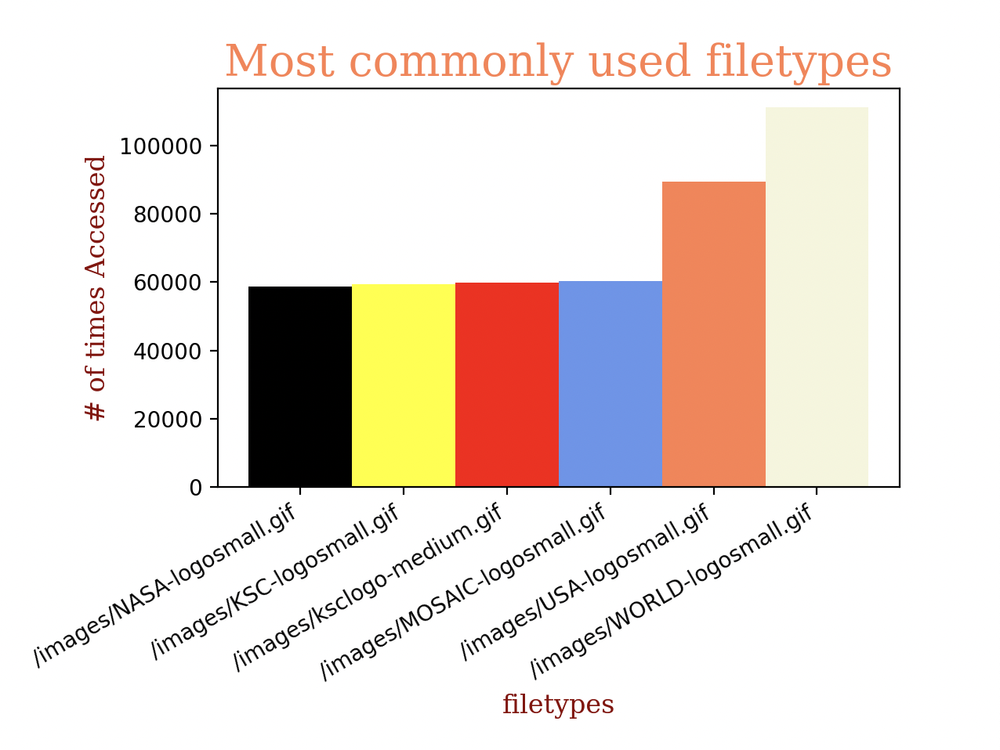

# Introduction
    I analyzed the web server log from NASA to identify what IP addresses were the most common as well as the filetypes of commonly used and opened files. It shows how many individuals had accessed those specific addresses and had used those specific filetypes although i only used the top 5 - 6 results for easier viewing. See the graphs below to see what the information for the data collected.

## Graph __IPAddress__ data

The first thing I analyzed was the commonly used IP addresses and the information i could gather were the following:
- The most accessed IP address was 'siltb10.orl.mmc.com'
- The least accessed IP address was 'alyssa.prodigy.com'
- The number of times accessed ranged from 7500 times to 17500 times.

## Graph __FileType__ data

The second thing I analyzed was the commonly used filetypes and this had a wider range of numbers than the Ip addresses. The info i could gather from here was as followed:
- The biggest filetype was '/imagines/WORLD-logosmall.gif'
- The 3 smallest filetypes all had a number of 59k - 60k
- The difference of the most commnonly used filetype and the 3 smallest filetypes is 41k - 40k access times.

